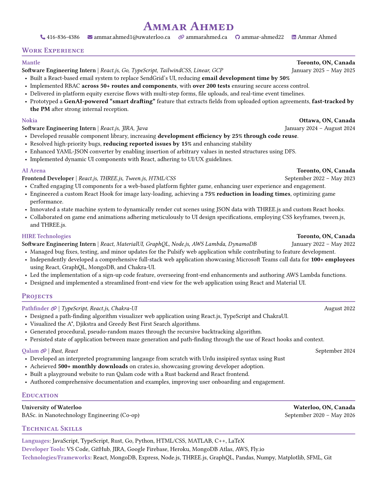

<div align="center">
  <h2>Ammar Ahmed's Resume</h2> 
  <a href="https://github.com/ammar-ahmed22/typst-resume/releases" >
    
  </a>
  <p>
    Welcome to the home of my resume! Here I host my data-driven, continously deployed resume made possible by <a href="https://typst.app">Typst</a>!
  </p>
  
</div>

### ✨ How It Works
This section explains the workflow and technologies behind the creation and maintenance of my resume.

- **Automated Updates:** On every tagged update, the source files are compiled and released with a [custom authored GitHub action](https://github.com/ammar-ahmed22/compile-typst-action).
- **Data-Driven Resume:** Due to the power of [Typst](https://typst.app), all my resume data is housed in a `.yml` file. Typst is able to read and parse the data which I used to define custom functions to render my resume!
- **Version Control:** All tags and releases are semantically versioned. I've also authored a custom post-commit hook which prompts me if I want to tag the commit. The git hook automatically bumps the version based on the latest tag and whether it is a major, minor, or patch change!

Here's how it looks when I make a commit:
```bash
>> git add . && git commit -m "Some changes"
[post-commit hook] Commit done!
Would you like to tag this commit? [y/N] y
[current-version]: v1.7
Is this a major change or a minor change? minor
[bumping-version]: v1.8
[main 0d0fce2] Some changes
 2 files changed, 30 insertions(+), 4 deletions(-)
```

- **Testing:** Being a `NodeJS` fan, I set up a `package.json` in this repo to be able to run `yarn` commands to compile my resume locally.

<!-- Test comment to test version bump release -->

### 🔗 Connect With Me
I am always open to connecting with professionals from the industry and discussing potential opportunities.

<div align="center">
  <a href="https://linkedin.com/in/ammarahmed2203">
    
  </a>
  <a href="https://ammarahmed.ca">
    
  </a>
  <a href="mailto:ammar.ahmed1@uwaterloo.ca">
    
  </a>
</div>
